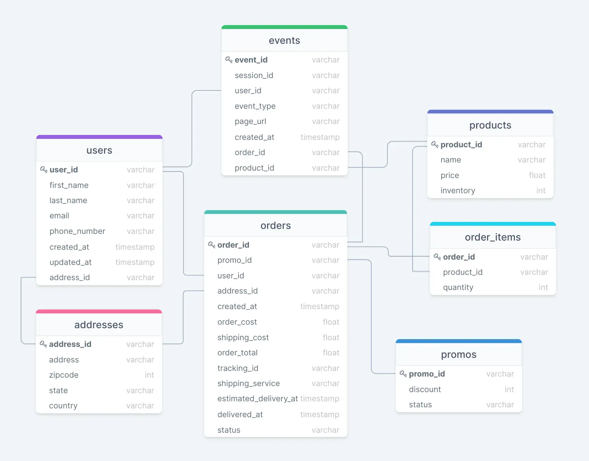
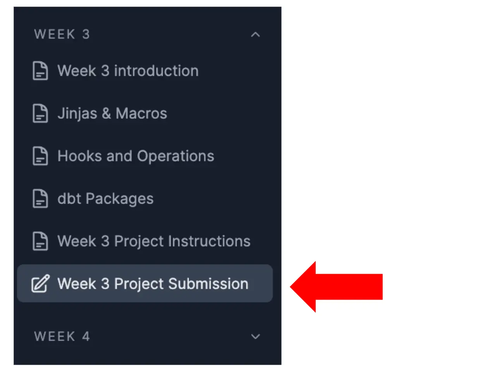

# Week 1 Project Instructions

## Introduction
Welcome to your first project! This week we'll create our first dbt project for our company "greenery" including source, staging, snapshot models, etc. We'll then do some queries of our data to ensure everything is set up correctly.

The material you'll need for this project is included in the course materials. We suggest coming to our project session on Wednesdays where we'll go over and begin the project together. We highly suggest reading the course materials ahead of this session.

Project details and submission instructions listed below. 

## Project Detail
### Data background
For the duration of our course, we’ll be working with a few data sets from our company, greenery. We’ll focus on just a few data sources that are common across any e-commerce company: users, addresses, orders, order_items, products, promos, events.

Below, we can see the ERD (entity relationship diagram) of our data, with the column names in each source, as well as the data types of each column.



### Project questions
Imagine you’re a new analytics engineer at a tech startup, greenery, that delivers flowers and houseplants. They’ve hired you as the first data person to help them understand the state of the business and determine where they need to improve to grow revenue and acquire new customers. You’ve heard of dbt, the tool every analytics engineer needs to learn how to use, and decide to start a dbt project to layout and transform the data you have available to you.

#### (1) Start a new dbt project 
Note: check out week 0 for set up

SNOWSIGHT + SIGMA CRASH COURSE
If you're new to Snowflake and/or Sigma, watch this quick loom by co-instructor Jake Hannan here: https://www.loom.com/share/21e174c34ed64932b8a39ee42cd0aa59

#### (2) Using source data in our data warehouse and dbt models, set up the staging models for each source (raw) table.
Note: details on source tables, staging models, etc is included in week 1 dbt fundamentals part 1 + 2.

1. Using the instructions in the set up instructions here

+ Setup the dbt project called greenery which creates the project folder structure

+ Configure the dbt_project.yml and profiles.yml files with the right credentials

2. For all the tables (7) in the greenery schema shown in the ER diagram above:

+ Configure a _postgres__sources.yml file with the seven sources in the models/staging/postgres/ directory. 

+ NOTE: the name of your source should be postgres since thats where this source data originates

+ Create staging dbt models in models/staging/postgres/ from each of them (You’ll end up with seven .sql files)

+ NOTE: a good best practice to follow is to not select * in your staging model, but explicitly select each column so you can rename and cast as needed.

+ Create a _postgres__models.yml file with all the staging model names and descriptions in the models/staging/postgres/ directory

3. Run your dbt models against the data warehouse using the dbt run command

#### (3) dbt Snapshots
Let's set up our snapshot models! At Greenery, we want to understand how our data is changing over time. For some data, like events, this is already possible. For other datasets, like products, we only know what that table looks like at a point in time. Some questions that the business might be asking could be:

+ How often are items going out of stock? And how quickly are they back in stock?

+ What does an order's lifecycle typically look like?

+ How is our pricing changing over time?

These kinds of questions would be hard to answer without snapshots. To help our stakeholders answer these types of questions, let's practice setting up a snapshot model on our products source:

1. Create a snapshot model using the products source in the /snapshots/ directory of our dbt project that monitors the inventory column. 

NOTE: Since we want the snapshots to build in your personal snowflake schema (and not in the snapshots schema) you'll need to add some additional configs in your snapshot model for the target_database and target_schema:

```
{{
  config(
    target_database = target.database,
    target_schema = target.schema,
    strategy='check',
    unique_key='product_id',
    check_cols=['inventory'],
   )
}}
```

2. Run the snapshot model to create it in our database (dbt snapshot)

3. You won't see any changes now, but we will re-run our snapshots in weeks 2, 3, and 4 to see how our data changes over time!

#### (4) Answer these questions using the data available using SQL queries. You should query the dbt generated (staging) tables you have just created. For these short answer questions/queries create a separate readme file in your repo with your answers.
+ How many users do we have?

+ On average, how many orders do we receive per hour?

+ On average, how long does an order take from being placed to being delivered?

+ How many users have only made one purchase? Two purchases? Three+ purchases?

+ Note: you should consider a purchase to be a single order. In other words, if a user places one order for 3 products, they are considered to have made 1 purchase.

+ On average, how many unique sessions do we have per hour?

##### You'll now save project code and readme to your github repo 

In your gitpod terminal, the git workflow will look something like this: 

```
git add . 
git commit -m "your commit message"
git push
```

### Reference Resources
#### SETUP
Project set up instructions here: https://corise.com/course/analytics-engineering-with-dbt/module/setup

Submission Instructions
Please submit in Project Submission on the left side bar or by going here. 




#### IMPORTANT SUBMISSION INSTRUCTIONS
Your projects are due Sunday every week end of day. You will add a link to your repo (include a readme file with your short answer questions) and answer self-review questions. Your submission will be automatically posted to #dbt-projects-apr22 slack channel.

Once you are submit you will be assigned to peer review classmates (due EOD Monday). 